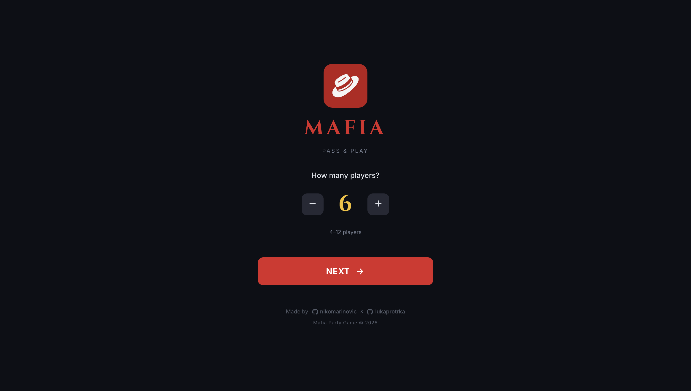

<h1 align="center">
  
   
  Mafia Party Game
</h1>

  A modern web implementation of the classic social deduction game Mafia — play with friends, assign roles automatically, and manage games effortlessly.

  <a href="https://mafiapartygame.netlify.app">
    https://mafiapartygame.netlify.app
  </a>

---

## What is Mafia Party Game?

**Mafia Party Game is a browser-based companion app for hosting Mafia games:**

- Automatic role assignment
- Easy lobby creation and joining
- Fast game setup for parties
- Mobile-friendly player experience
- Moderator-assisted gameplay

**`Designed to remove setup friction and let players focus on fun, strategy, and social deduction.`**

---

## How It Works

Mafia Party Game is designed to be used on **one shared mobile device** as a helper tool during a real-life Mafia game.

1. **Gather Players** — Everyone sits together in real life.
2. **Start the Game** — Open the app on a single phone.
3. **Assign Roles** — Players pass the phone and secretly receive their role.
4. **Play the Game** — Use the app for guided night actions and voting.
5. **Continue Offline** — Discussion, bluffing, and gameplay happen face-to-face.

> [!TIP]
> Pass the phone around so each player can privately view their role without others seeing.

---

## Features
-	Lobby System — Create private games with shareable codes.
-	Automatic Role Distribution — No manual setup required.
-	Moderator Support — Control game flow easily.
- Real-Time Gameplay — Players interact live during phases.
- Responsive Design — Works on phones, tablets, and desktops.

---

## Screenshots

  

  

  

---

## Data & Privacy

Mafia Party Game stores only the minimal temporary game data required to run active sessions.

> [!NOTE]
> No permanent player accounts or personal data storage are required.

> [!WARNING]
> Game sessions may reset if the server restarts. This project is intended for casual gameplay use.

---

<h3 align="center">
Mafia Party Game does not accept feature implementations via pull requests. Feature requests and bug reports are welcome through GitHub issues.
</h3>

---

  © 2026 Niko Marinović. All rights reserved.

